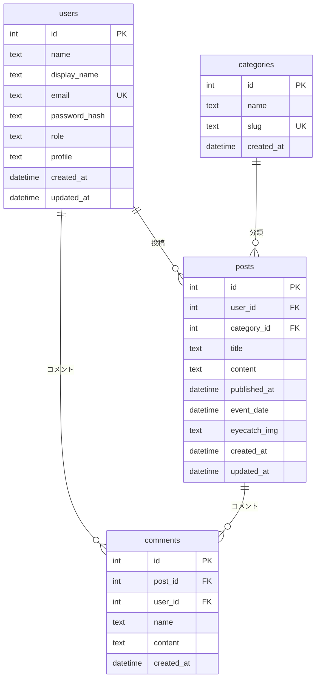

# データベース設計書

心理療法士同好会 Webサイトで使用する SQLite データベースの設計です。

## 概要

| 項目 | 内容 |
|------|------|
| RDBMS | SQLite |
| 文字コード | UTF-8 |
| スキーマ定義 | `docs/schema.sql` |
| ORM | Flask-SQLAlchemy（モデル定義は `app/models.py`） |

---

## エンティティ関連図



---

## テーブル一覧

| テーブル名 | 説明 |
|------------|------|
| users | 利用者（会員・管理者） |
| categories | 記事カテゴリー |
| posts | 投稿（記事・イベント告知など） |
| comments | 記事へのコメント |

---

## 1. users（利用者）

ログイン可能な会員および管理画面を利用する管理者を格納します。

| カラム名 | 型 | NULL | デフォルト | 説明 |
|----------|-----|------|------------|------|
| id | INTEGER | NO | 自動採番 | 主キー。利用者を一意に識別するID。 |
| name | TEXT | NO | — | 名前（必須）。ログインや管理画面での識別に利用。 |
| display_name | TEXT | YES | — | 表示用の名前。記事・ブログ等で表示する場合に使用。未設定の場合は name を表示。 |
| email | TEXT | NO | — | ログイン用メールアドレス。一意（UNIQUE）。 |
| password_hash | TEXT | NO | — | パスワードのハッシュ。Werkzeug の scrypt 等で保存。平文は保存しない。 |
| role | TEXT | NO | 'member' | 権限。`admin`（管理者）または `member`（会員）。CHECK 制約でこの2つのみ許可。 |
| profile | TEXT | YES | — | 自己紹介・プロフィール文。任意。 |
| created_at | DATETIME | — | CURRENT_TIMESTAMP | レコード作成日時。 |
| updated_at | DATETIME | — | CURRENT_TIMESTAMP | レコード更新日時。更新のたびに更新。 |

**補足**

- 管理画面へのログインは `role = 'admin'` のユーザーのみ可能です。
- パスワードの設定・検証は `User.set_password()` / `User.check_password()` で行います。
- 画面上で利用者名を表示する際は、`display_name` が設定されていればそれを使い、未設定なら `name` を使います（モデルの `display_name_or_name` プロパティ）。

---

## 2. categories（カテゴリー）

記事を分類するためのマスタです。トピックス・イベント・エッセーなど、種別ごとに1レコードです。

| カラム名 | 型 | NULL | デフォルト | 説明 |
|----------|-----|------|------------|------|
| id | INTEGER | NO | 自動採番 | 主キー。カテゴリーを一意に識別するID。 |
| name | TEXT | NO | — | 表示用のカテゴリー名（例：トピックス、イベント告知）。 |
| slug | TEXT | NO | — | URL・プログラム内で使う識別子。英小文字・ハイフンなど。一意（UNIQUE）。例：`topics`, `event`, `essay`。 |
| created_at | DATETIME | — | CURRENT_TIMESTAMP | レコード作成日時。 |

**補足**

- 一覧のフィルタや「トピックス」「イベント」などの表示は `slug` で判定しています。
- `slug = 'event'` のカテゴリーでは、記事の「イベント開催日」が必須になります。

---

## 3. posts（投稿）

ブログ記事・イベント告知・お知らせなどの投稿内容を格納します。

| カラム名 | 型 | NULL | デフォルト | 説明 |
|----------|-----|------|------------|------|
| id | INTEGER | NO | 自動採番 | 主キー。記事を一意に識別するID。 |
| user_id | INTEGER | NO | — | 投稿者。users.id への外部キー。ON DELETE CASCADE。 |
| category_id | INTEGER | NO | — | カテゴリー。categories.id への外部キー。ON DELETE CASCADE。 |
| title | TEXT | NO | — | 記事のタイトル（見出し）。 |
| content | TEXT | NO | — | 本文。HTML 可（TinyMCE 等で編集）。 |
| published_at | DATETIME | — | CURRENT_TIMESTAMP | 公開日時。この日時を過ぎると一覧・詳細で「公開」として表示。日本時間（JST）で入力・比較する想定。 |
| event_date | DATETIME | YES | — | イベント開催日時。カテゴリーが「イベント」の場合に使用。任意。 |
| eyecatch_img | TEXT | YES | — | アイキャッチ画像のファイル名。実体は `static/uploads/eyecatch/` に保存。 |
| created_at | DATETIME | — | CURRENT_TIMESTAMP | レコード作成日時。 |
| updated_at | DATETIME | — | CURRENT_TIMESTAMP | レコード更新日時。 |

**補足**

- 公開判定は「現在時刻（JST）」と `published_at` の比較で行っています。
- `event_date` はイベントカテゴリー用。一覧の日付表示や「開催日」として利用します。
- `user_id` は管理画面の「投稿者」選択に紐づき、記事の著者表示（author）に使います。

**インデックス**

- `idx_posts_user_id` … user_id
- `idx_posts_category_id` … category_id

---

## 4. comments（コメント）

記事に対するコメントを格納します。会員ログイン済みの場合は user_id を紐づけ、未ログインの場合は名前のみで投稿できます。

| カラム名 | 型 | NULL | デフォルト | 説明 |
|----------|-----|------|------------|------|
| id | INTEGER | NO | 自動採番 | 主キー。コメントを一意に識別するID。 |
| post_id | INTEGER | NO | — | 対象記事。posts.id への外部キー。ON DELETE CASCADE。 |
| user_id | INTEGER | YES | — | 会員としてコメントした場合の利用者。users.id への外部キー。非会員の場合は NULL。ON DELETE SET NULL。 |
| name | TEXT | NO | — | 表示名。会員の場合は users.name を、非会員の場合は入力された名前を保存。 |
| content | TEXT | NO | — | コメント本文。 |
| created_at | DATETIME | — | CURRENT_TIMESTAMP | 投稿日時。 |

**補足**

- 記事削除時にコメントは CASCADE で削除されます。
- 会員削除時はその会員のコメントの `user_id` が SET NULL になり、`name` は残ります。

**インデックス**

- `idx_comments_post_id` … post_id（記事ごとのコメント取得用）

---

## 既存データベースへ display_name を追加する場合

すでに `users` テーブルがある環境で `display_name` を追加する場合は、次の SQL を実行してください。

```sql
ALTER TABLE users ADD COLUMN display_name TEXT;
```

---

## リレーション概要

| 親テーブル | 子テーブル | 関係 | 外部キー |
|------------|------------|------|----------|
| users | posts | 1 対 多 | posts.user_id → users.id |
| users | comments | 1 対 多 | comments.user_id → users.id |
| categories | posts | 1 対 多 | posts.category_id → categories.id |
| posts | comments | 1 対 多 | comments.post_id → posts.id |

---

## 初期データ（schema.sql）

- **users**: 管理者1件（email: `admin@example.com`, role: `admin`）。
- **categories**: トピックス、エッセー・書評、イベント、研究会、その他 の5件（schema により名前・slug が若干異なる場合があります。実際は `docs/schema.sql` を参照）。

アプリ側のシード（`flask seed-db`）では、別のカテゴリーセットや管理者パスワード（例: `password123`）で投入する場合があります。運用に合わせて `schema.sql` または `app/commands.py` のどちらを正とするか決めてください。
